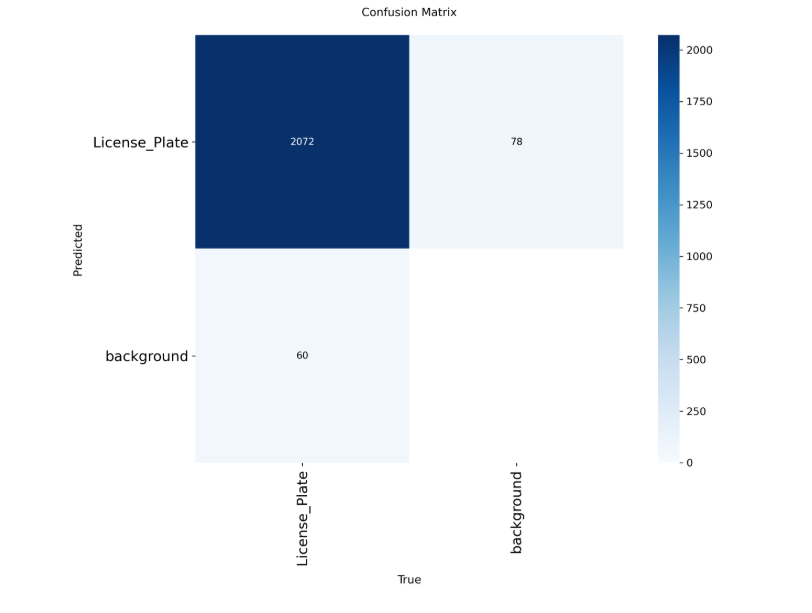
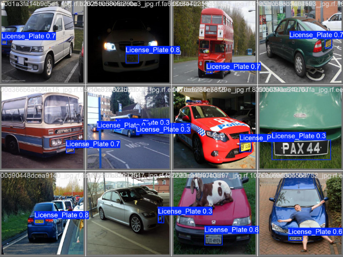
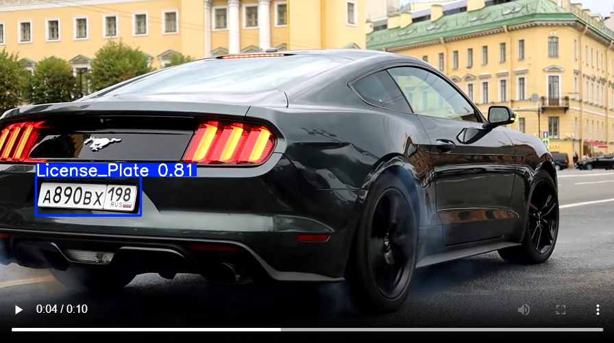
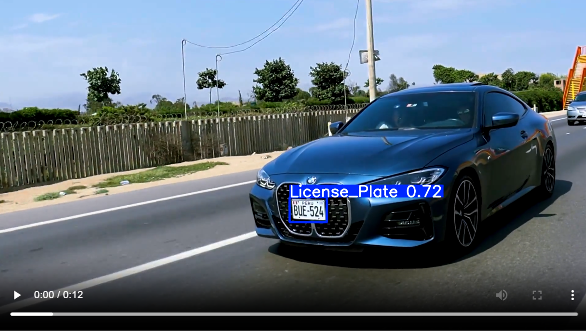

# License_Plate_Recognition

### Project Overview

License Plate Recognition (LPR) plays an essential role in intelligent transportation systems, security enforcement, and smart parking solutions. This project applies the YOLOv11 object detection model to detect vehicle license plates in real-world images and videos. Using a dataset hosted on Roboflow, the model was trained and evaluated to achieve robust detection performance.

### 📂 Dataset

Source: Roboflow Universe – [License Plate Recognition](https://universe.roboflow.com/roboflow-universe-projects/license-plate-recognition-rxg4e) Dataset (Version 4).
Format: YOLO annotation format (.txt with bounding boxes).
Classes: License Plate (single class).
Preprocessing: Images resized to 640x640, normalization, and augmentations applied automatically via Roboflow.

### 🧠 Methodology

Frameworks & Libraries: Roboflow, Ultralytics YOLO, PyTorch, TorchVision, TorchAudio.
Model Architecture: YOLOv11n (nano version for lightweight, fast inference).
Training:
Input size: 640×640
Epochs: 25
Optimizer: Adam/SGD (handled by YOLO defaults)
Loss functions: YOLO detection loss (objectness + classification + bounding box regression)
Evaluation: Metrics include Precision, Recall, mAP, and confusion matrix.
Visualization: Training curves (results.png), confusion matrix, and validation predictions provided.

### 📊 Results

The model successfully detected license plates with strong accuracy.
Key evaluation artifacts:
        ✅ Confusion Matrix
        ✅ Training Metrics (loss, mAP, precision, recall)
        ✅ Validation Predictions

#### 🔍 Sample Results

**Training Results Curve**  

**Confusion Matrix**  

**Sample Predictions on Validation Set**  

**Video Inference Example (Frame Capture)**  

